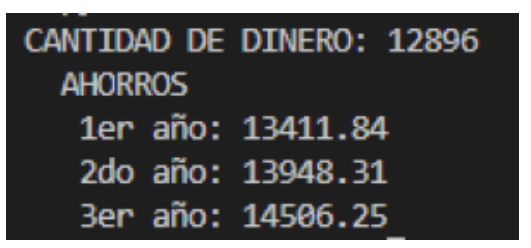
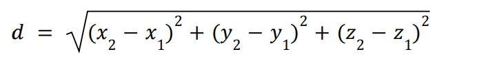

# TP1-IPRO1-python
Trabajo practico de ingenieria informatica/Introducción a la programación

# TP01 - Estructura Secuencial en Python

## Algoritmos

### Casos de Estudio

Analice, diseñe y codifique los siguientes enunciados en Python:

1. Calcular el volumen de una esfera cuya fórmula es:

𝑣 = (4/3) * π * 𝑟^3

#-----------------------------------------------------------------------------

2. Dados el precio de un producto y el número de unidades a comprar, muestre el importe de dinero a pagar.

#------------------------------------------------------------------------------

### Ejercicios

1. Dado el siguiente código en Python:

 = input("Introduce el dividendo (entero): ")
m = input("Introduce el divisor (entero): ")
print(n + " entre " + m + " da un cociente " + str(int(n) // int(m)) + " y un resto " + str(int(n) % int(m)))

● Muestre el resultado con n = 2 y m = 5
● ¿Puede obtener un resultado para cualquier valor de m?
● ¿Qué operador utiliza para calcular el resto?
● Modifique el código quitando str() en la 3er línea, ¿qué sucede?

#-------------------------------------------------------------------------------

2. Resuelva y muestre el valor y el tipo de las siguientes expresiones aritméticas y muestre los valores resultantes para `x`, `y` y `z`, pruebe con valores enteros para las variables de entrada:

#------------------------------------------------------------------------------------

3. Tienes una nueva cuenta de caja de ahorros que te ofrece el 4% de interés al año. Estos ahorros debido a
intereses, que no se cobran hasta finales de año, se te añaden al final del período. Escribir un algoritmo que
comience leyendo la cantidad de dinero depositada en la cuenta de ahorros. Calcular y mostrar por pantalla la
cantidad de ahorros tras el primer, segundo y tercer años. Redondear cada cantidad a dos decimales. Ejemplo
de ejecución para una cantidad de dinero depositada de 12896

#__------------------------------------------------------------------------------------

4. Calcule el perímetro y la superficie de un rectángulo solicitando al usuario la longitud de sus lados.

5. Dados los catetos de un triángulo rectángulo, calcular su hipotenusa.

6. Solicite el ingreso de una cantidad de pesos Argentinos, dar su equivalente en dólares y en euros. Se sabe que 1 dólar = 202,30 pesos y 1 euro = 214,30 pesos (formatee los resultados a 3 decimales).

7. Solicite el valor de un ángulo en Radianes conviértalo a grados Sexagesimales y luego a Centesimales. Muestre los resultados en pantalla. Fórmula de conversiones: sexadecimal = valorEnRadian * 180 / Pi, centesimal = valorEnRadian * 200 / Pi

8. Determine la distancia entre dos puntos en el espacio. Punto 1: (x1, y1, z1) y Punto 2: (x2, y2, z2).

#-----------------------------------------------------------------------------------

9. Diseñar un programa que permita calcular el índice de masa corporal de una persona.

